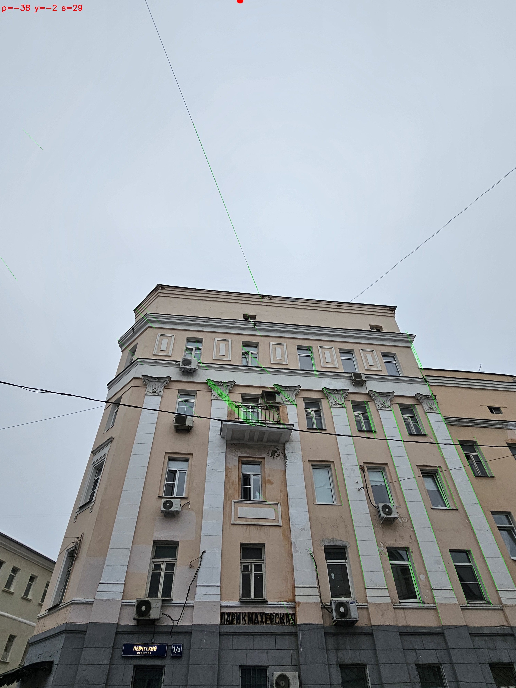
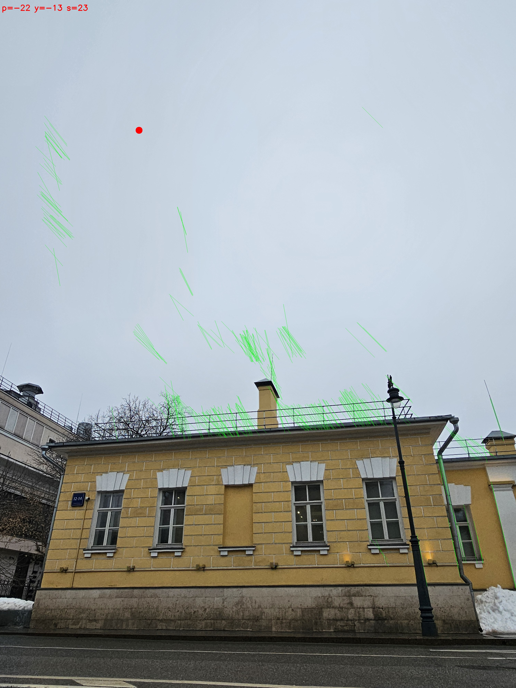
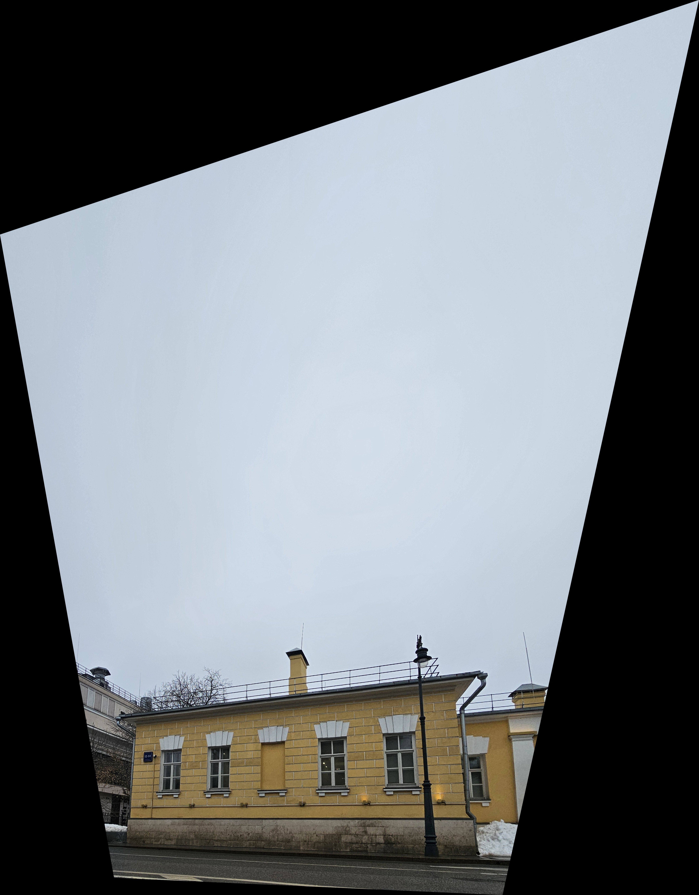

# Ректификация фасадов зданий по точке схода

Консольное приложение на Python, которое убирает перспективные искажения на фотографиях зданий. Вертикальные линии фасада разъезжаются из-за наклона камеры, программа их выпрямляет.

---

## Что сделано

- **Детектирование фасадных линий** — оператор Canny + вероятностное преобразование Хафа, затем фильтрация шумов (провода, горизонтали, слишком короткие линии)
- **Поиск точки схода** — перебор случайных пар линий (RANSAC-подход): выбирается точка, через которую проходит максимум линий
- **Ректификация** — по точке схода строится матрица гомографии, изображение перспективно выравнивается
- **Метрики качества** — автоматически считаются 4 метрики до и после, результат сохраняется в JSON
- **Пакетная обработка** — можно передать папку, обработаются все JPG/PNG разом
- **Отчёт** — скрипт `report.py` читает JSON и выводит таблицу с рейтингом по качеству

---

## Структура проекта

```
RECTIFY/
├── data/
│   ├── raw/               # исходный датасет (фото фасадов)
│   └── outputVP/          # готовые результаты: выровненные фото + JSON
├── src/
│   ├── detector.py        # выделение фасадных линий
│   ├── vanishing_point.py # поиск точки схода
│   ├── rectifier.py       # гомография и ректификация
│   ├── metrics.py         # метрики качества
│   └── annotator.py       # debug-картинки и сохранение JSON
├── main.py                # точка входа
├── report.py              # сводный отчёт по датасету
└── requirements.txt
```

## Данные

Датасет и готовые результаты хранятся на Google Drive:  https://drive.google.com/drive/folders/1nS0HRKk0c01ubfE6RJFpIehrWW3q6aAY?usp=sharing

- `raw/` — исходный датасет (фото фасадов)
- `outputVP/` — выровненные изображения (`*_rectified.jpg`)
---

## Установка

```bash
git clone https://github.com/<your-username>/rectify.git
cd rectify
pip install -r requirements.txt
```

Зависимости: `opencv-python`, `numpy`

---

## Использование

**Одно фото:**
```bash
python main.py data/raw/photo.jpg
```

**Одно фото + vp-картинка** (линии и точка схода нарисованы поверх):
```bash
python main.py data/raw/photo.jpg --debug
```

**Вся папка:**
```bash
python main.py data/raw/ -o data/outputall/
```

**Вся папка + vp:**
```bash
python main.py data/raw/ -o data/outputall/ --debug
```

**Без JSON**
```bash
python main.py data/raw/ -o data/outputall/ --no-annotate
```

**Отчет по результатам** (после обработки папки запустить):
```bash
python report.py -o data/outputVP/
```

Скрипт читает все JSON из папки и выводит таблицу: файл, угол наклона камеры, score точки схода, метрики до/после и итоговая оценка. Флаг `--top N` — показать только топ-N лучших снимков

---

## Метрики качества

Все метрики считаются **до и после** ректификации

| Метрика | Что показывает |
|---|---|
| `verticality_error` | Насколько линии фасада отклоняются от вертикали (в градусах) |
| `parallelism_std` | Насколько линии параллельны друг другу (разброс углов) |
| `vp_residual_px` | Среднее расстояние от линий до точки схода (в пикселях) |
| `vp_horizon_distance` | Как далеко точка схода от центра кадра (нормировано) |


---

## Пример работы

### Пример 1

| До | После ректификации |
|---|---|
|  |  |

### Пример 2

| До | После ректификации |
|---|---|
|  |  |


  - `p` — pitch, наклон камеры вверх/вниз в градусах
  - `y` — yaw, поворот камеры влево/вправо в градусах
  - `s` — score: сколько линий подтвердили точку схода
